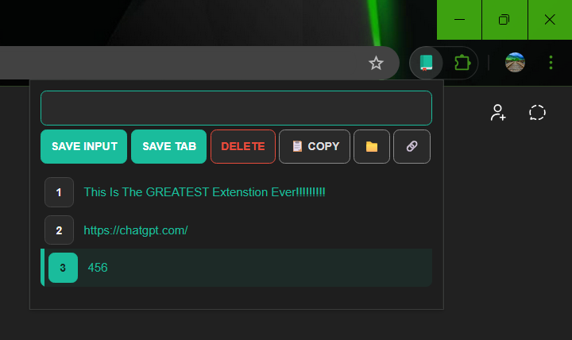

# Linkest Extension



## Overview

Linkest is a powerful Chrome extension designed to streamline link management and note-taking directly in your browser. Save URLs, organize text snippets, and access everything with an intuitive interface featuring advanced selection controls and one-click actions.

## ✨ Features

### Core Functionality

- **Quick Save Input**: Save any text or URL instantly with the input field
- **One-Click Tab Saving**: Capture your current tab's URL with a single click
- **Smart URL Detection**: Automatically detects URLs vs. plain text and handles them appropriately
- **Google Search Integration**: Non-URL text automatically opens as a Google search

### Advanced Selection & Management

- **Multi-Select**: Click index numbers to select individual items
- **Range Selection**: Hold Shift and click to select multiple items at once
- **Select All**: Use Ctrl/Cmd + A to select or deselect all items
- **Quick Copy**: Click any item to copy it to clipboard, or use the copy button for multiple selections
- **Smart Delete**: Delete selected items or the top item if none selected
- **Position Insertion**: Insert items at specific positions using "N. text" format

### Additional Tools

- **Batch Link Opening**: Open selected links (or the first item) in new tabs
- **Local File Browser**: Open local files directly in your browser via the 📁 button
- **Persistent Storage**: All saved items persist using localStorage
- **Keyboard Shortcuts**:
  - `Enter` to save input
  - `Delete` key to remove items (when input is empty)
  - `Ctrl/Cmd + Click` on links to open in new tab
  - `Ctrl/Cmd + A` to select/deselect all

## 🎨 User Interface

- **Dark Theme**: Easy on the eyes with a modern dark color scheme
- **Visual Selection Feedback**: Selected items are highlighted with teal accents
- **Numbered Index Buttons**: Quick access to select and manage individual items
- **Responsive Design**: Optimized layout with smooth wave effects on interactions

## 🚀 Setup

To install and use this extension locally:

1. **Clone the repository**

   ```bash
   git clone https://github.com/yourusername/linkest-extension.git
   cd linkest-extension
   ```

2. **Load in Chrome**
   - Open Chrome and navigate to `chrome://extensions/`
   - Enable **Developer mode** (toggle in upper-right corner)
   - Click **Load unpacked**
   - Select the project directory

3. **Start using Linkest!**
   - Click the extension icon in your toolbar
   - Begin saving links and text

## 📁 Project Structure

```
linkest-extension/
├── index.html          # Main extension popup
├── manifest.json       # Extension configuration
├── styles/
│   ├── index.css      # Main styles with CSS variables
│   └── effects.css    # Wave animation effects
├── scripts/
│   ├── index.js       # Core functionality
│   └── materialize.js # UI effects library
└── Screenshot.png     # Extension preview
```

## 🛠️ Technical Details

- **Storage**: Uses Chrome's localStorage API for data persistence
- **Modern JavaScript**: ES6+ features including async/await, arrow functions, and destructuring
- **CSS Variables**: Centralized theming for easy customization
- **Accessibility**: ARIA labels and keyboard navigation support

## 🤝 Contributing

This is a personal project, but suggestions and improvements are welcome!

- **Found a bug?** Open an issue with details
- **Have an idea?** Share it in the issues section
- **Want to contribute?** Fork the repo and submit a pull request

## 📄 License

This project is licensed under the MIT License - see the [LICENSE](LICENSE) file for details.

## 🔮 Future Enhancements

- [ ] Cloud sync across devices
- [ ] Tag/category system for organization
- [ ] Export/import functionality
- [ ] Custom keyboard shortcuts
- [ ] Search/filter saved items
- [ ] Drag-and-drop reordering

---

**Made with 💚 for productivity enthusiasts**
